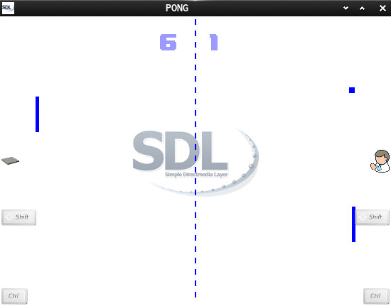

This is a simple pong implementation.  
AI, State Integration and timing needs love.  
You can build 2 executeables. One with static size,  
which is easier to review and a second version which  
scales in size - so you can play it in stamp size or  
UHD =)

But this may be done later with subpixel rendering.  

AI-notes:  
Human rection time (RT) is about 200-300 ms max.  
Since this AI doesn't interpolate I cheated.  
RT could be ranged rand, like visibility could.  
But since this is no rocket science it's good for now.  

Screenshot:  

Useful links:  
[classic Pong and Breakout stuff](https://github.com/Acry/SDL2-pong_issue-01)  
[SDL2](https://www.libsdl.org/)   [SDL-Discourse](https://discourse.libsdl.org)   [More Example Code](https://gist.github.com/Acry/baa861b8e370c6eddbb18519c487d9d8)

[Get in touch on SDL-Discourse](https://discourse.libsdl.org/u/Acry/summary)
